# Blackjack

Blackjack, also known as twenty-one, is a classic card game renowned for its blend of strategy and luck. Players strive to outscore the dealer without surpassing 21. The game's simplicity and suspense, combined with its strategic depth, make blackjack a beloved favorite among players of all skill levels.

By building the game with Code Institute's Python Template, it offers the flexibility to run online rather than solely on a CLI or Command Line Interface.

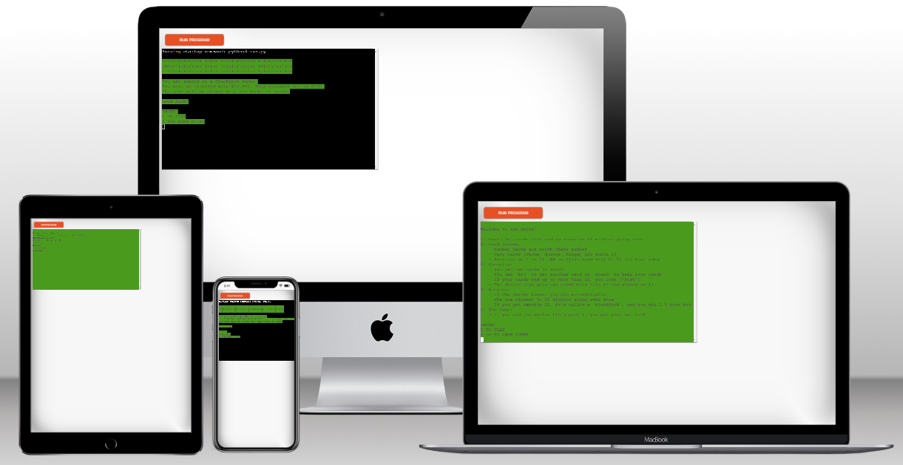


## How to play

To play blackjack, each player is dealt two cards face-up, while the dealer receives one card face-up and one face-down. The goal is to get a hand total closer to 21 than the dealer without going over. Players can choose to "hit" to receive another card, "stand" to keep their current hand. The game blends luck and strategy, as players must decide when to take risks and when to play it safe. 

## User Experience

### Developer Goals

- Create a traditional blackjack game in Python that accurately reflects the rules and mechanics of the game.
- Implement an intuitive user interface that allows players to easily understand and interact with the game.
- Ensure the game provides an enjoyable and immersive experience for players, capturing the excitement of playing blackjack in a real casino environment.

### User Goals

- Experience the thrill of playing blackjack in a virtual setting.
- Understand the rules and objectives of the game clearly, facilitating smooth gameplay.
- Enjoy a challenging and entertaining gaming experience that simulates the excitement of traditional blackjack.

## Structure

- The game structure is designed to be as simple as possible, enabling easy navigation through user input and ensuring straightforward gameplay with minimal interaction required from the user.

## Features

In this section, I'll offer a brief summary of the features included in the blackjack game.

### Game Lobby

- Upon starting the game, users are greeted with an welcome message rendered in ASCII art through the Pyfiglet module. They are then provided with a brief overview of how the game functions, along with the choice to either initiate gameplay right away or take a closer look at the game rules first.

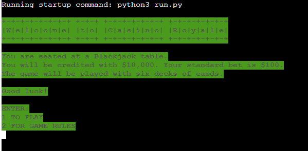

### Game Rules

- In this section, the rules of the game are clearly explained in a concise manner, and the user is given another choice through the game menu to either return to the game lobby or initiate gameplay.

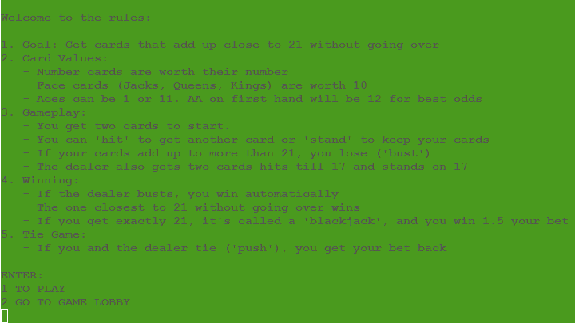

### Gameplay

- In the initial deal, both the dealer and the player receive two cards each. One card from the dealer is not shown and is represented as an X. Additionally, the player is provided with the total bankroll and the number of cards remaining in the deck. A menu in capital letters below presents the option to HIT or STAND.

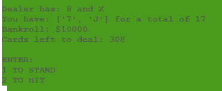

- The game continues based on the player's decision. 
- After the player's and the dealer's actions, the game declares the winner and updates the bankroll. The player is then presented with options through the game menu to continue playing.


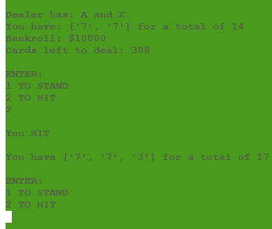

- The game accounts for scenarios where the player runs out of money or there are no more cards left to deal. In such cases, the player is credited again, and the deck is reshuffled to ensure continuous gameplay.

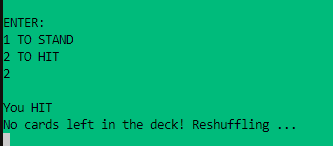

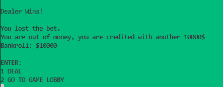


### Invalid input

 - Invalid input (If the user's input is any character other than the provided options.)

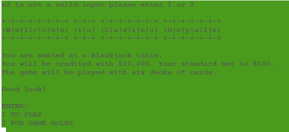

- Invalid input,  the screen is cleared, and the user is prompted again.

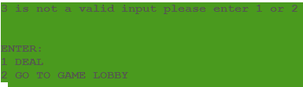

 ### Future Futures

 - Future features will include offering the player the possibility to split hands and control the betting amount.

 ## Data model / Flow Chart

 - 

 ## Testing

 ### Validator Testing

 - The python code is free of errors and written correctly, validation through the PEP8 online validator was performed with no errors or warnings raised.
 


### Manual Testing

- Manual testing was done throughout the developing process, where all user inputs have the desired effect. If a user input is invalid, a relevant message will tell the user what to input instead.
- Testing was performed in both the Gitpod terminal and Code Institutes Heroku mock terminal in several different browsers, such as Chrome, Edge and Firefox.
- All features respond as expected and give the correct error messages when user input is invalid.
- Additionally, I conducted rigorous hard-coded testing to validate various specific game scenarios, some examples have been documented in the accompanying images below:

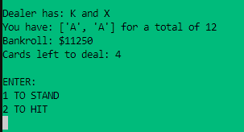

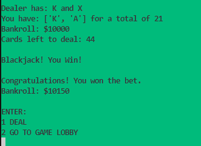

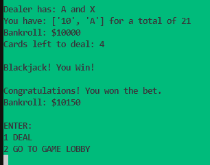

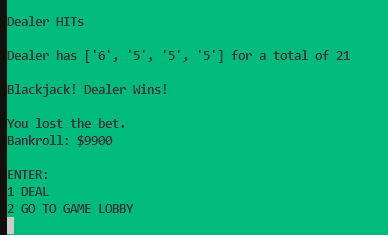

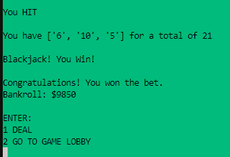

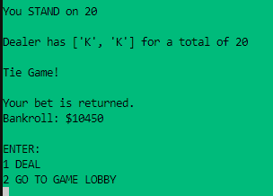

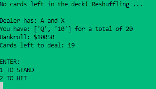


## Bugs

- The most notable bug encountered during testing occurred when both the player and dealer were dealt more than three cards each in the initial hand. This issue has been effectively resolved by adjusting the code to reset the player and dealer hands within the main game loop, ensuring a fresh start with each new hand.

## Remaining bugs

- All bugs have been successfully addressed and resolved.

## Technologies Used

### Languages

[Python](https://www.python.org/)

### Python Libraries and Modules

[Random](https://docs.python.org/3/library/random.html) - The random module provides functions for generating random numbers and making random selections in Python.

[Pyfiglet](https://pypi.org/project/pyfiglet/) - Pyfiglet is a Python library for generating ASCII art text with various font styles.

[Copy](https://docs.python.org/3/library/copy.html) - The copy module offers functions for creating copies of objects in Python, both shallow and deep copies.

[OS](https://docs.python.org/3/library/os.html) - The os module provides functions for interacting with the operating system, such as file handling and system commands, in a portable way.

[Time](https://docs.python.org/3/library/time.html) - The time module offers functions for working with time-related operations, such as measuring time intervals and handling timestamps, in Python.

[Colorama](https://pypi.org/project/colorama/) - Colorama is a Python library that simplifies adding colored output and styling to terminal text. 

### Programs & Libraries

- [Git](https://git-scm.com/) -  Git was used through the Gitpod terminal to commit to Git and push to GitHub.
- [GitHub](https://github.com/) - All code for the site is stored on GitHub after being pushed from Git.
- [Heroku](https://id.heroku.com/login) - Used for hosting the game.
- [ASCII]() - The ASCII art used in the game was generated with this app.
- [PEP8 Online Validator](https://pep8ci.herokuapp.com/) - Validation of Python code was done with PEP8 Online.


## Deployment

 The game was deployed using Heroku. 
 - Steps for deployment:
   - Go to Heroku's website at https://www.heroku.com and sign up/log in.
   - Click on the New button near the top right corner, and select Create new app.
   - Name the project and set the region to the relevant one, then click the ```Create app``` button.
   - Click on ```Add buildpack``` and add ```Python```, click ```Save changes```. Repeat the process for ```nodejs``` and make sure they are in the correct order, with ```Python``` coming first.
   - Next, navigate to the ```Deploy``` tab and under ```Deployment method``` connect to your GitHub account.
   - Directly below Deployment method there is a search bar to search for your repository. Connect the correct one to Heroku by clicking the ```Connect``` button.
   - Scroll down to Manual deploy and click ```Deploy Branch```, making sure that the main branch is selected.
   - To enable automatic updates to the project, simply scroll up to Automatic deploys and click the ```Enable Automatic Deploys``` button.
   - My project is now hosted on Heroku.
   - The live link can be found here - [Blackjack](https://play-blackjack-c03d4ce79b7f.herokuapp.com/)

## Credits

I drew inspiration and incorporated code from:

[Code Coach](https://youtu.be/mpL0Y01v6tY?si=OhQaz7PRaGz02qxM)

[LeMaster Tech](https://youtu.be/e3YkdOXhFpQ?si=n4RfvmGltE9G03MR)

[PyPi](https://pypi.org/project/colorama/)

[Real Python](https://realpython.com/python-sleep/)

[Geeksforgeeks](https://www.geeksforgeeks.org/python-ascii-art-using-pyfiglet-module/)

- **Content**

- Wikipedia was used for inspiration to write the game rules.

  [Blackjack Wikipedia](https://en.wikipedia.org/wiki/Blackjack)

   